> [!NOTE]
> **Sample post.** A reference for every formatting feature this site supports — open this file next to the rendered page and copy what you need. It's marked `"sample": true` in `data/posts.json`, so it only shows in preview mode.

## Headings and the table of contents

Use `##` for sections and `###` for sub-sections — both appear in the **On this page** sidebar on wide screens. `####` is available for small headings and stays out of the sidebar. Hover any heading and click `#` to copy a link to it. Don't repeat the post title as a heading; it comes from `posts.json`.

### A sub-section

Indented in the table of contents.

#### A small heading

Not in the table of contents.

## Text

### Inline styles

| You write | You get |
| --- | --- |
| `**bold**` | **bold** |
| `*italic*` | *italic* |
| `***bold italic***` | ***bold italic*** |
| `~~strikethrough~~` | ~~strikethrough~~ |
| `` `inline code` `` | `inline code` |
| ``` `` code with a ` backtick `` ``` | `` code with a ` backtick `` |
| `<mark>highlight</mark>` | <mark>highlight</mark> |
| `<kbd>Ctrl</kbd> + <kbd>K</kbd>` | <kbd>Ctrl</kbd> + <kbd>K</kbd> |
| `H<sub>2</sub>O`, `x<sup>2</sup>` | H<sub>2</sub>O, x<sup>2</sup> |
| `<abbr title="Dead-letter queue">DLQ</abbr>` | <abbr title="Dead-letter queue">DLQ</abbr> (hover it) |
| `<small>fine print</small>` | <small>fine print</small> |

### Paragraphs and line breaks

A blank line starts a new paragraph. A single line break inside a paragraph is ignored,
so this sentence continues on the same line.

End a line with a backslash to force a break\
like this — or use `<br>`.<br>Like this.

### Special characters

Escape Markdown characters with a backslash: \*not italic\*, \# not a heading, \[not a link\], 5 \* 3. Emoji and Unicode work as-is: ✅ ⚠️ 🚀 → ≥ ≤ ≈ ✓ ×.

## Links

- Another page on this site: [the blog](blog.html)
- A specific write-up: [Saga orchestrator](work.html?slug=saga-orchestrator)
- A section on this page: [jump to Tables](#tables)
- External (opens in a new tab): [Kafka documentation](https://kafka.apache.org/documentation/)
- Automatic link: <https://mermaid.js.org> or just https://github.com
- Email: <hello@example.com>
- With a tooltip: [hover me](https://example.com "Shown on hover")
- Reference-style, handy for long URLs: [Spring Kafka docs][spring-kafka]

[spring-kafka]: https://docs.spring.io/spring-kafka/reference/

## Lists

### Unordered and ordered

- Unordered item
- Another item with **bold** and `code`
  - Nested item
    - Deeper item

1. First
2. Second
   1. Nested numbered
   2. Another
3. Third

Start numbering anywhere:

7. Seventh step
8. Eighth step

### Rich list items

1. **A step with several paragraphs.**

   Indent follow-up paragraphs by three spaces so they stay inside the item.

2. **A step with code:**

   ```bash
   kafka-consumer-groups --describe --group inventory-recovery
   ```

3. **A step with a quote:**

   > Measure before you optimise.

### Task list

- [x] Write the outline
- [x] Add a diagram
- [ ] Publish

### Definition list

<dl>
  <dt>Idempotent</dt>
  <dd>Running an operation twice has the same effect as running it once.</dd>
  <dt>Compensation</dt>
  <dd>A new business action that semantically undoes an earlier step.</dd>
</dl>

## Quotes and callouts

> Make it work, make it right, make it fast. — Kent Beck

> Quotes can be nested:
>
> > This is a reply inside the quote.
>
> And contain lists:
>
> - one
> - two

> [!NOTE]
> Useful information that readers should know, even when skimming.

> [!TIP]
> Helpful advice for doing things better or more easily.

> [!IMPORTANT]
> Key information readers need to achieve their goal.

> [!WARNING]
> Urgent info that needs immediate attention to avoid problems.

> [!CAUTION]
> Advises about risks or negative outcomes of certain actions.

> [!TIP]
> Callouts can hold **several paragraphs**, lists and code.
>
> - Retry with backoff
> - Send poison messages to a DLQ
>
> ```yaml
> retry: { attempts: 3, backoff: 2s }
> ```

## Code

Add a language after the opening fence for syntax highlighting. Hover a block to copy it.

```java
@KafkaListener(topics = "orders.cancelled", groupId = "inventory-recovery")
public void onOrderCancelled(OrderCancelled event) {
    if (processed.exists(event.id())) {
        return; // already handled — safe to skip on redelivery
    }
    inventory.release(event.orderId(), event.items());
    processed.mark(event.id());
}
```

```typescript
type Token = { kind: "number" | "ident" | "op"; value: string };

export function tokenize(input: string): Token[] {
  return [...input.matchAll(/\d+|[A-Za-z_]\w*|[-+*/(),]/g)].map(([value]) => ({
    kind: /^\d/.test(value) ? "number" : /^\w/.test(value) ? "ident" : "op",
    value,
  }));
}
```

```javascript
const sent = new Set();
export async function notify(order) {
  if (sent.has(order.id)) return;
  await whatsapp.send(order.phone, `Your order ${order.id} is ready`);
  sent.add(order.id);
}
```

```python
def chunk(items, size):
    for i in range(0, len(items), size):
        yield items[i : i + size]
```

```sql
SELECT order_id, COUNT(*) AS barcodes
FROM order_barcodes
GROUP BY order_id
HAVING COUNT(*) > 1;
```

```yaml
spring:
  kafka:
    consumer:
      enable-auto-commit: false
      max-poll-records: 200
```

```json
{ "orderId": "CL-482917", "status": "CANCELLED", "items": 2 }
```

```bash
kafka-consumer-groups --bootstrap-server localhost:9092 \
  --describe --group inventory-recovery
```

```diff
- inventory.decrement(sku, 1);
+ inventory.reserve(orderId, sku, 1); // idempotent: keyed by order
```

Also highlighted: `go`, `kotlin`, `ruby`, `graphql`, `lua`, `xml`/`html`. Any other language label still shows as a plain block with its name.

No language, or `text`, gives a plain block — good for terminal output and ASCII diagrams:

```text
Producer ──► orders.cancelled ──► Consumer ──► Inventory DB
                                     │
                                     └──► DLQ (after 3 retries)
```

Long lines scroll sideways instead of wrapping:

```java
throw new IllegalStateException("Order " + orderId + " cannot be cancelled because it has already been shipped to " + address + " on " + shippedAt);
```

## Tables

### Basic

| Approach | Ordering | Complexity | Good for |
| --- | --- | --- | --- |
| Choreography | Per entity | Low | Few services, simple flows |
| Orchestration | Global | Medium | Multi-step flows with rollback |
| 2PC | Strict | High | Rarely worth it in microservices |

### Column alignment

Colons in the separator row set alignment: `:---` left, `:---:` centre, `---:` right.

| Service | Status | p95 latency | Error rate |
| :--- | :---: | ---: | ---: |
| Orders | ✅ | 120 ms | 0.02% |
| Inventory | ⚠️ | 480 ms | 0.40% |
| Payments | ✅ | 95 ms | 0.01% |

### Formatting inside cells

| Topic | Notes |
| --- | --- |
| **Retries** | Use `exponential backoff`; see [the saga write-up](work.html?slug=saga-orchestrator) |
| *Idempotency* | Key by `(orderId, step)` — a literal pipe needs escaping: `a \| b` |
| Empty cell | |
| Line break | first line<br>second line |

### Wide tables

Wide tables scroll sideways on phones instead of breaking the layout.

| Region | Jan | Feb | Mar | Apr | May | Jun | Jul | Aug | Sep | Oct | Nov | Dec |
| --- | ---: | ---: | ---: | ---: | ---: | ---: | ---: | ---: | ---: | ---: | ---: | ---: |
| North | 120 | 132 | 141 | 150 | 162 | 170 | 168 | 175 | 181 | 190 | 204 | 230 |
| South | 98 | 101 | 110 | 115 | 121 | 130 | 128 | 133 | 140 | 146 | 152 | 171 |

## Images

Put images in `content/images/` and reference them relative to the Markdown file — the same path works in VS Code's Markdown preview. Every image opens full-size on click.

An image with a caption (the text in quotes):

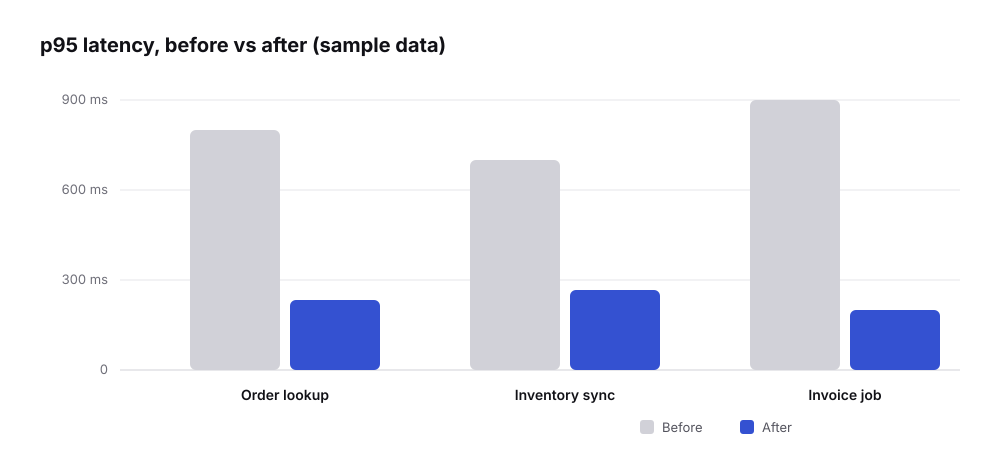

A PNG screenshot works the same way (PNG, JPG, WebP, SVG and GIF are all fine):

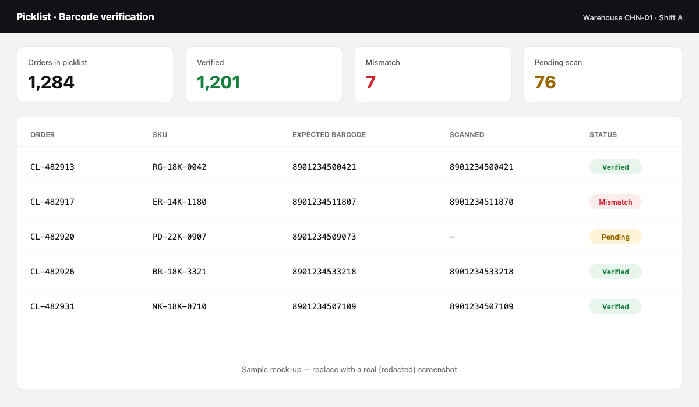

Without a caption:

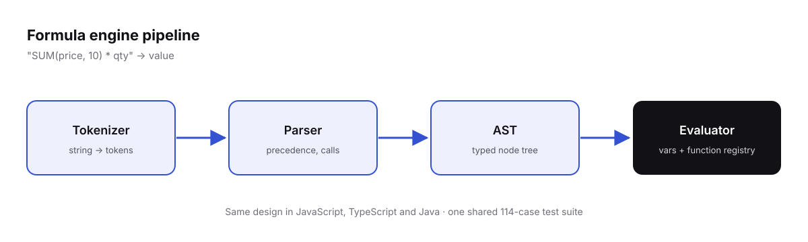

An image that links somewhere (click goes to the link, not the zoom):

[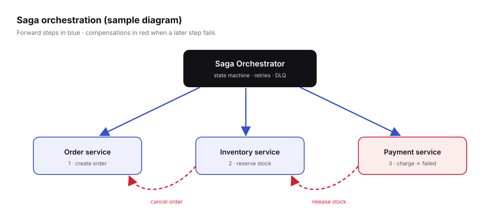](work.html?slug=saga-orchestrator)

A smaller image — use HTML with a `width`. In HTML the path is from the site root (`content/images/…`), not relative to the Markdown file:


Several images side by side (they stack on phones):

<div class="image-row">
  
  
</div>

## Video and embeds

Paste an embed's `<iframe>` (YouTube, Loom, CodePen, Google Slides…) on its own line — it becomes a responsive 16:9 frame. For example:

```html
<iframe src="https://www.youtube.com/embed/VIDEO_ID" title="Talk: Kafka in production" allowfullscreen></iframe>
```

A video file in `content/images/` works with `<video src="content/images/demo.mp4" controls></video>`.

## Diagrams (Mermaid)

Write a diagram as text in a ` ```mermaid ` block. They render in greys in light mode, switch automatically in dark mode, and a syntax mistake shows the error and the source instead of breaking the page. Draft diagrams live at [mermaid.live](https://mermaid.live).

> [!NOTE]
> Types whose keyword ends in `-beta` are new in Mermaid and their syntax may still change. Every type below renders with the bundled Mermaid 12.3.0; ZenUML loads a small plugin automatically.

### Flowchart

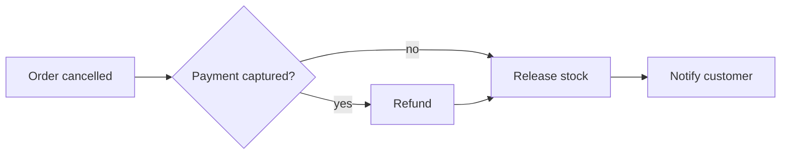
```mermaid
flowchart LR
    A[Order cancelled] --> B{Payment captured?}
    B -- yes --> C[Refund]
    B -- no --> D[Release stock]
    C --> D
    D --> E[Notify customer]
```

### Class

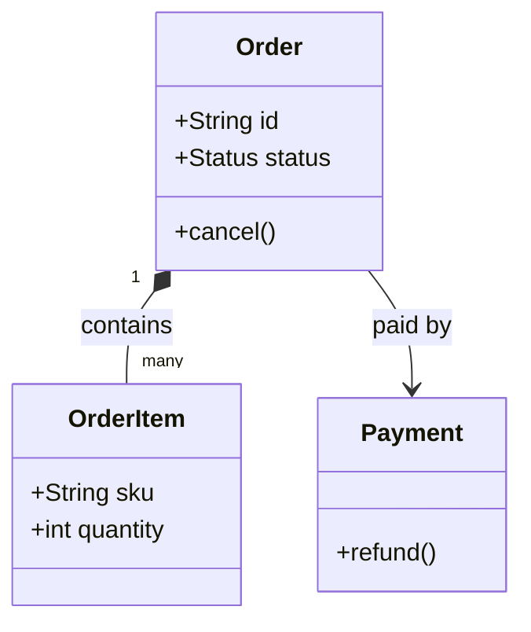
```mermaid
classDiagram
    class Order {
      +String id
      +Status status
      +cancel()
    }
    class OrderItem {
      +String sku
      +int quantity
    }
    class Payment {
      +refund()
    }
    Order "1" *-- "many" OrderItem : contains
    Order --> Payment : paid by
```

### Sequence

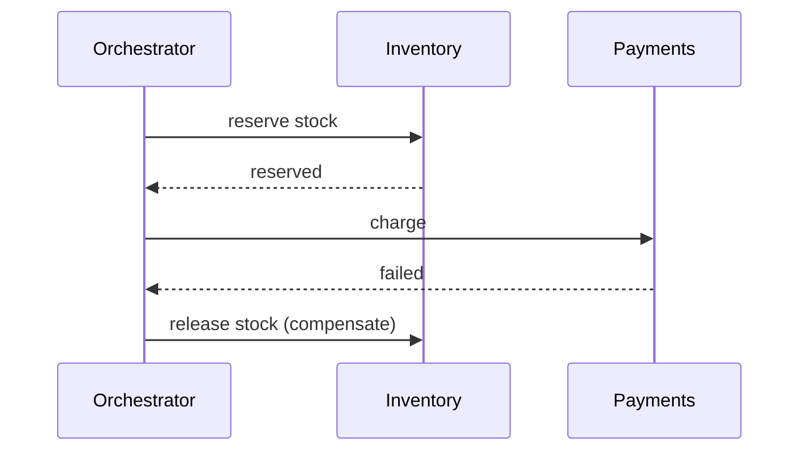
```mermaid
sequenceDiagram
    participant O as Orchestrator
    participant I as Inventory
    participant P as Payments
    O->>I: reserve stock
    I-->>O: reserved
    O->>P: charge
    P-->>O: failed
    O->>I: release stock (compensate)
```

### Entity relationship

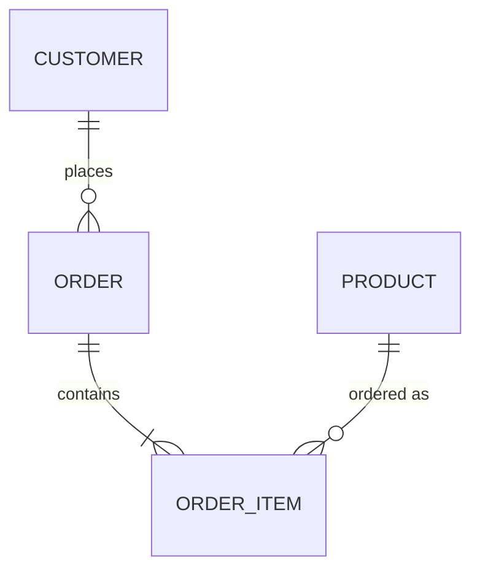
```mermaid
erDiagram
    CUSTOMER ||--o{ ORDER : places
    ORDER ||--|{ ORDER_ITEM : contains
    PRODUCT ||--o{ ORDER_ITEM : "ordered as"
```

### State

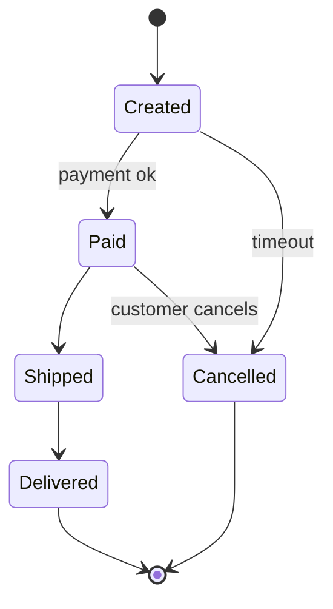
```mermaid
stateDiagram-v2
    [*] --> Created
    Created --> Paid : payment ok
    Created --> Cancelled : timeout
    Paid --> Shipped
    Paid --> Cancelled : customer cancels
    Shipped --> Delivered
    Delivered --> [*]
    Cancelled --> [*]
```

### Mindmap

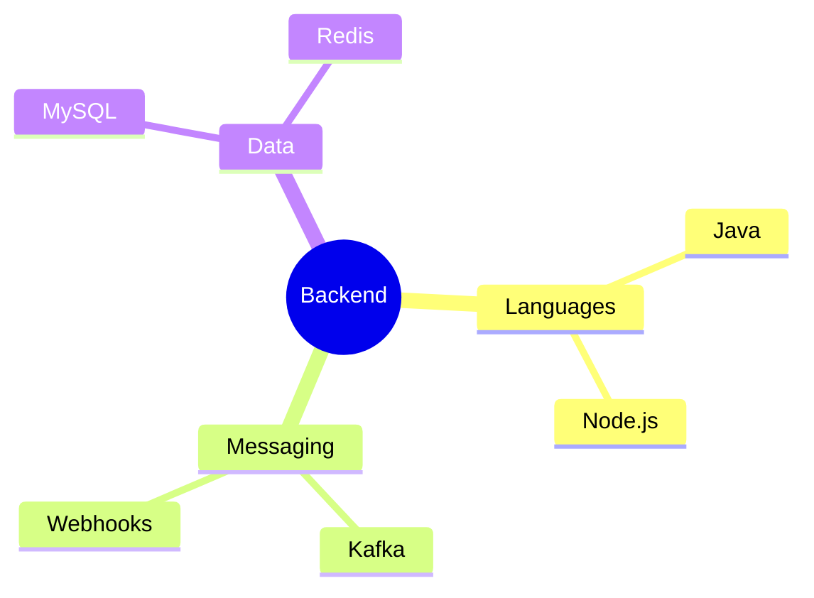
```mermaid
mindmap
  root((Backend))
    Languages
      Java
      Node.js
    Messaging
      Kafka
      Webhooks
    Data
      MySQL
      Redis
```

### Architecture

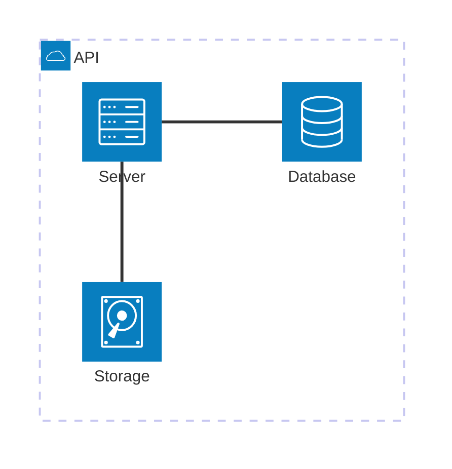
```mermaid
architecture-beta
    group api(cloud)[API]

    service db(database)[Database] in api
    service disk1(disk)[Storage] in api
    service server(server)[Server] in api

    db:L -- R:server
    disk1:T -- B:server
```

### Block

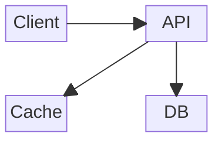
```mermaid
block
  columns 3
  Client space API
  space space space
  Cache space DB
  Client --> API
  API --> Cache
  API --> DB
```

### C4

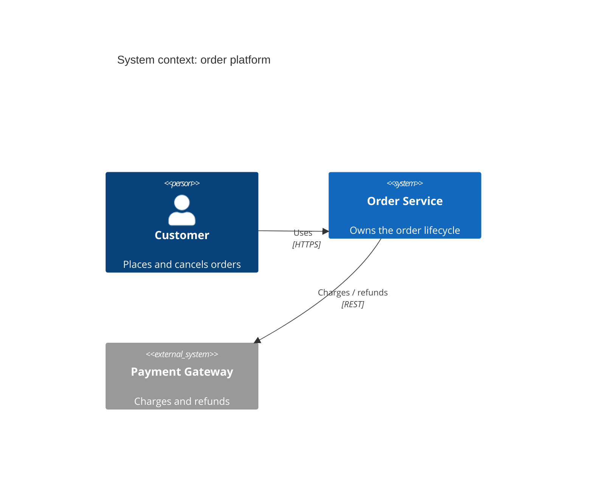
```mermaid
C4Context
  title System context: order platform
  Person(customer, "Customer", "Places and cancels orders")
  System(orders, "Order Service", "Owns the order lifecycle")
  System_Ext(pay, "Payment Gateway", "Charges and refunds")
  Rel(customer, orders, "Uses", "HTTPS")
  Rel(orders, pay, "Charges / refunds", "REST")
```

### Cynefin framework

```mermaid
cynefin-beta
  title Incident response
  complex
    "New failure mode"
  complicated
    "Performance tuning"
  clear
    "Restart a stuck consumer"
  chaotic
    "Full outage"
  chaotic --> complex : "Stabilised"
  complex --> complicated : "Pattern identified"
  complicated --> clear : "Runbook written"
```

### Event modeling

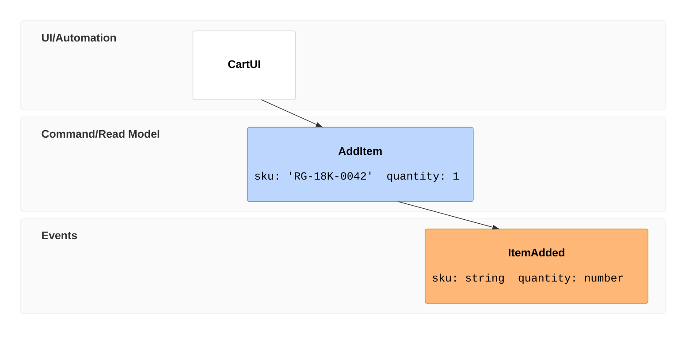
```mermaid
eventmodeling

timeframe 01 ui CartUI
timeframe 02 command AddItem [[AddItem01]]
timeframe 03 event ItemAdded [[ItemAdded]]

data AddItem01 {
  sku: 'RG-18K-0042'
  quantity: 1
}

data ItemAdded {
  sku: string
  quantity: number
}
```

### Gantt

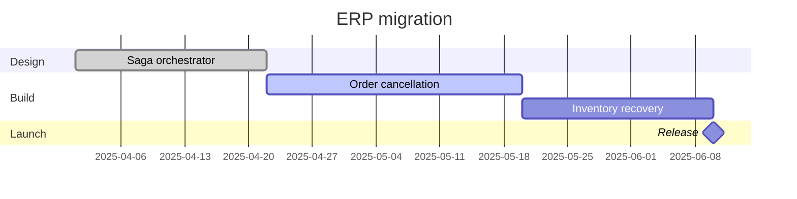
```mermaid
gantt
    title ERP migration
    dateFormat YYYY-MM-DD
    section Design
    Saga orchestrator   :done, d1, 2025-04-01, 3w
    section Build
    Order cancellation  :active, b1, after d1, 4w
    Inventory recovery  :b2, after b1, 3w
    section Launch
    Release             :milestone, m1, after b2, 0d
```

### Git graph

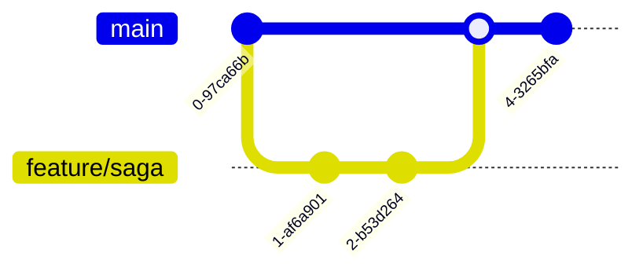
```mermaid
gitGraph
   commit
   branch feature/saga
   checkout feature/saga
   commit
   commit
   checkout main
   merge feature/saga
   commit
```

### Ishikawa (fishbone)

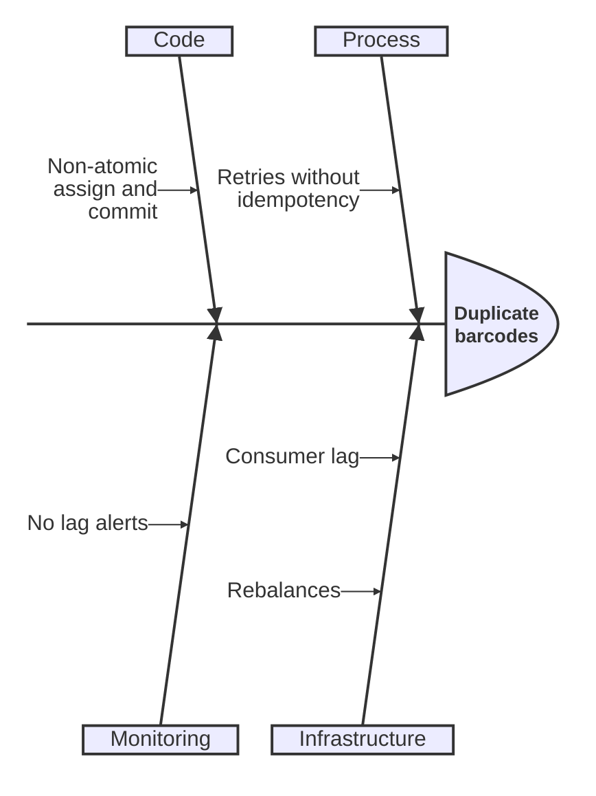
```mermaid
ishikawa-beta
    Duplicate barcodes
    Process
        Retries without idempotency
    Infrastructure
        Consumer lag
        Rebalances
    Code
        Non-atomic assign and commit
    Monitoring
        No lag alerts
```

### Kanban

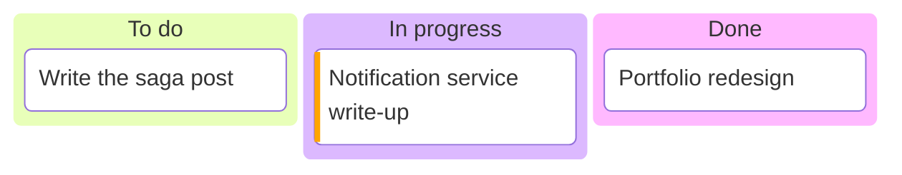
```mermaid
kanban
  todo[To do]
    t1[Write the saga post]
  doing[In progress]
    t2[Notification service write-up]@{ priority: 'High' }
  done[Done]
    t3[Portfolio redesign]
```

### Packet

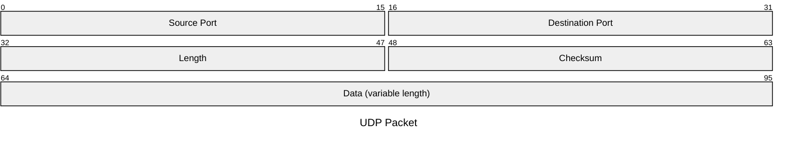
```mermaid
packet
title UDP Packet
+16: "Source Port"
+16: "Destination Port"
32-47: "Length"
48-63: "Checksum"
64-95: "Data (variable length)"
```

### Pie

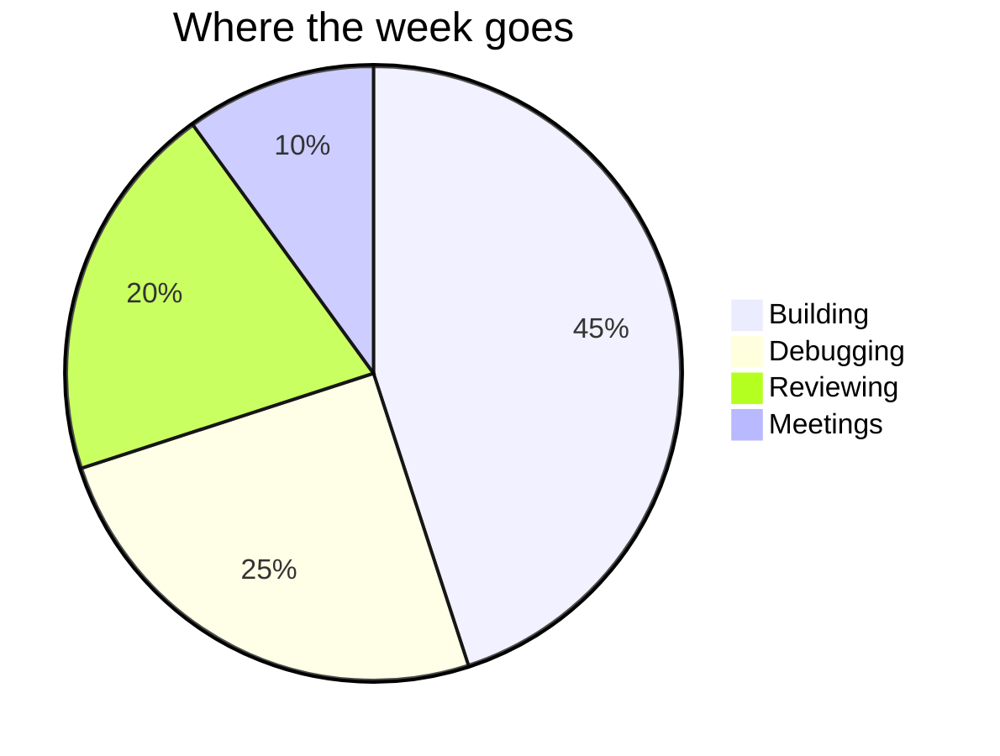
```mermaid
pie title Where the week goes
    "Building" : 45
    "Debugging" : 25
    "Reviewing" : 20
    "Meetings" : 10
```

### Quadrant

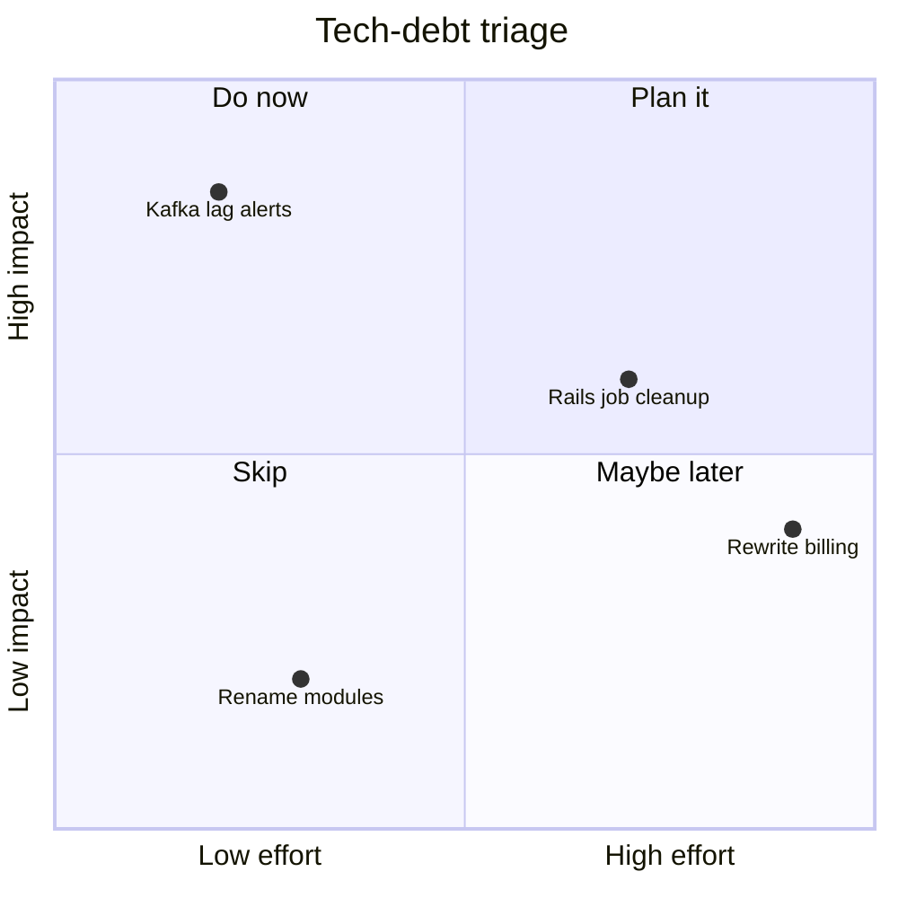
```mermaid
quadrantChart
    title Tech-debt triage
    x-axis Low effort --> High effort
    y-axis Low impact --> High impact
    quadrant-1 Plan it
    quadrant-2 Do now
    quadrant-3 Skip
    quadrant-4 Maybe later
    Kafka lag alerts: [0.2, 0.85]
    Rails job cleanup: [0.7, 0.6]
    Rename modules: [0.3, 0.2]
    Rewrite billing: [0.9, 0.4]
```

### Radar

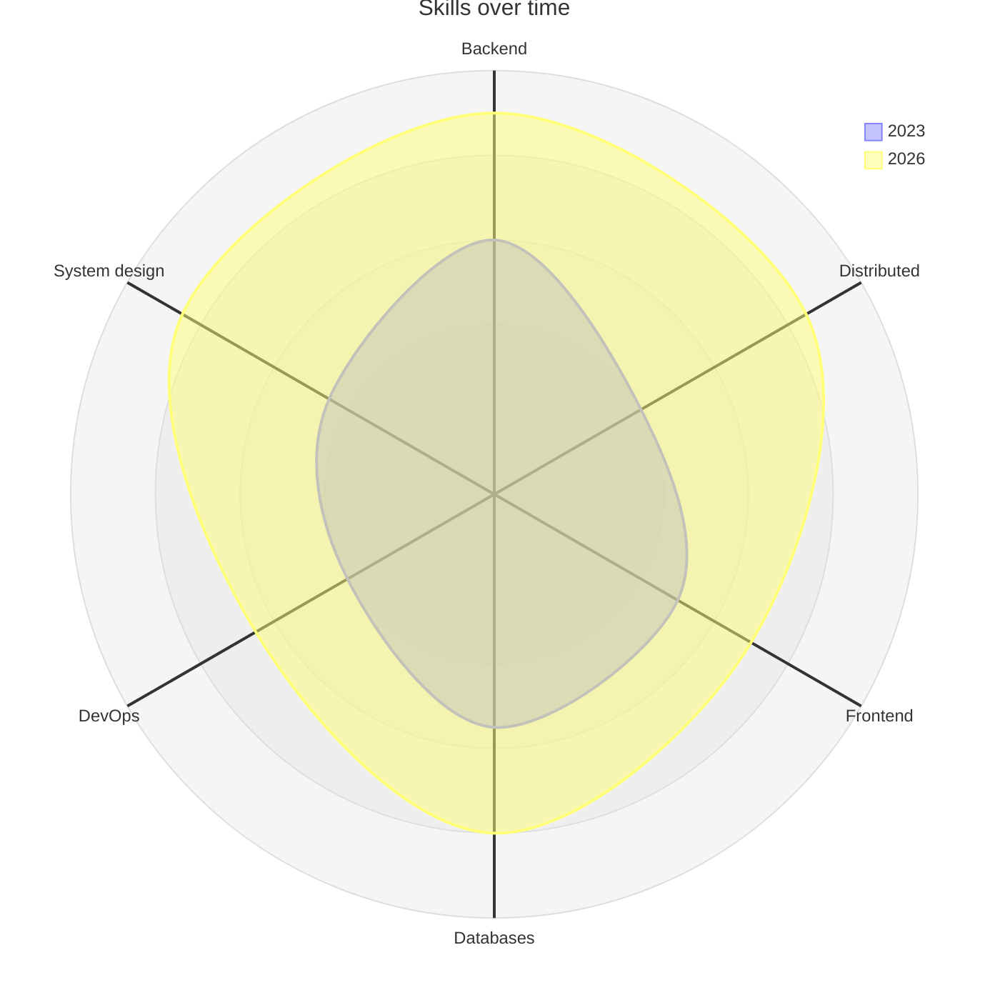
```mermaid
radar-beta
  title Skills over time
  axis be["Backend"], ds["Distributed"], fe["Frontend"]
  axis db["Databases"], ops["DevOps"], sd["System design"]
  curve a["2023"]{60, 40, 50, 55, 40, 45}
  curve b["2026"]{90, 85, 70, 80, 65, 85}
  max 100
  min 0
```

### Railroad (ABNF)

```mermaid
railroad-abnf-beta
title "Email Address"

address = local-part "@" domain ;
local-part = 1*( ALPHA / DIGIT / "." / "-" ) ;
domain = label *( "." label ) ;
label = 1*( ALPHA / DIGIT / "-" ) ;
```

### Railroad (EBNF)

```mermaid
railroad-ebnf-beta
title "Digit Definition"

digit = "0" | "1" | "2" | "3" | "4" | "5" | "6" | "7" | "8" | "9" ;
```

### Railroad (IR)

```mermaid
railroad-beta
title Expression Grammar

expression = sequence(
    nonterminal("term"),
    zeroOrMore(sequence(
        choice(terminal("+"), terminal("-")),
        nonterminal("term")
    ))
) ;
term = oneOrMore(nonterminal("digit")) ;
```

### Railroad (PEG)

```mermaid
railroad-peg-beta
title "Calculator Grammar"

Expression <- Term (("+" / "-") Term)* ;
Term <- Factor (("*" / "/") Factor)* ;
Factor <- Number / "(" Expression ")" ;
Number <- Digit+ ;
Digit <- "0" / "1" / "2" / "3" / "4" / "5" / "6" / "7" / "8" / "9" ;
```

### Requirement

```mermaid
requirementDiagram

requirement idempotency {
    id: 1
    text: Consumers must be safe to retry
    risk: high
    verifymethod: test
}

element consumer {
    type: service
}

consumer - satisfies -> idempotency
```

### Sankey

```mermaid
sankey

Orders,Invoiced,820
Orders,Cancelled,120
Orders,Pending,60
Pending,Reminder sent,60
```

### Swimlane

```mermaid
swimlane-beta LR
  subgraph Customer
    Browse[Browse catalogue]
    Pay[Pay]
  end
  subgraph Warehouse
    Pick[Pick items]
    Ship[Ship order]
  end
  subgraph Finance
    Invoice[Raise invoice]
  end
  Browse --> Pay
  Pay --> Pick
  Pick --> Ship
  Pay --> Invoice
```

### Timeline

```mermaid
timeline
    title Career
    2019 : B.Tech starts
    2023 : SDE I at CaratLane
    2025 : SDE II at CaratLane
    2026 : SDE at Freehand.ai
```

### Tree view

```mermaid
treeView-beta
    portfolio/
        data/
            posts.json
        content/
            posts/
        assets/
            js/
    index.html
```

### Treemap

```mermaid
treemap-beta
"Backend"
    "Java": 40
    "Node.js": 25
"Frontend"
    "React": 20
"Infra"
    "AWS": 10
    "Docker": 5
```

### Use case

```mermaid
usecase-beta
direction LR
actor Customer("Customer")
systemBoundary "Order system"
  Checkout("Place order")
  Cancel("Cancel order")
end
Customer --> Checkout
Customer --> Cancel
```

### User journey

```mermaid
journey
    title Cancelling an order
    section Request
      Open order page: 4: Customer
      Click cancel: 3: Customer
    section Processing
      Release stock: 5: System
      Refund payment: 2: System, Finance
```

### Venn

```mermaid
venn-beta
  set A["Backend"]
  set B["Frontend"]
  union A,B["Full-stack"]
```

### Wardley map

```mermaid
wardley-beta
title Tea Shop Value Chain

anchor Business [0.95, 0.63]
component Cup of Tea [0.79, 0.61]
component Tea [0.63, 0.81]
component Hot Water [0.52, 0.80]
component Kettle [0.43, 0.35]
component Power [0.10, 0.70]

Business -> Cup of Tea
Cup of Tea -> Tea
Cup of Tea -> Hot Water
Hot Water -> Kettle
Kettle -> Power

evolve Kettle 0.62
evolve Power 0.89
```

### XY chart

```mermaid
xychart
    title "p95 latency (ms)"
    x-axis [Jan, Feb, Mar, Apr, May]
    y-axis "ms" 0 --> 900
    bar [820, 760, 410, 300, 240]
    line [820, 760, 410, 300, 240]
```

### ZenUML

```mermaid
zenuml
    title Order cancellation
    Customer->OrderService: cancel order
    OrderService->InventoryService: release stock
    OrderService->PaymentService: refund
```

## Collapsible sections

<details>
<summary>Click to expand the full stack trace</summary>

```text
org.apache.kafka.clients.consumer.CommitFailedException:
  Commit cannot be completed since the group has already rebalanced
    at ConsumerCoordinator.sendOffsetCommitRequest(ConsumerCoordinator.java:1109)
```

</details>

<details>
<summary>Collapsible sections can hold any Markdown</summary>

Leave a blank line after `<summary>` and before `</details>`, and everything inside renders normally:

- lists
- **formatting**
- tables and images

</details>

## Hidden notes

Anything inside an HTML comment is invisible on the site — useful for TODOs while drafting:

```markdown
<!-- TODO: add the before/after numbers -->
```

<!-- This sentence is in the file but not on the page. -->

## Not supported

| Feature | Use instead |
| --- | --- |
| Footnotes (`[^1]`) | A superscript link: `<sup>[1](#notes)</sup>` and a "Notes" section at the end |
| Maths (LaTeX, `$x^2$`) | `x<sup>2</sup>`, Unicode (∑ √ ≤ π), or an image |
| Emoji shortcodes (`:rocket:`) | Paste the emoji itself: 🚀 |
| Coloured text | Not part of the design — use **bold**, <mark>highlight</mark> or a callout |

## Horizontal rule

Use `---` on its own line (with a blank line above) to separate parts of a long post.

---

That's everything. Start a real post with `node scripts/new-post.mjs "Title"`.
